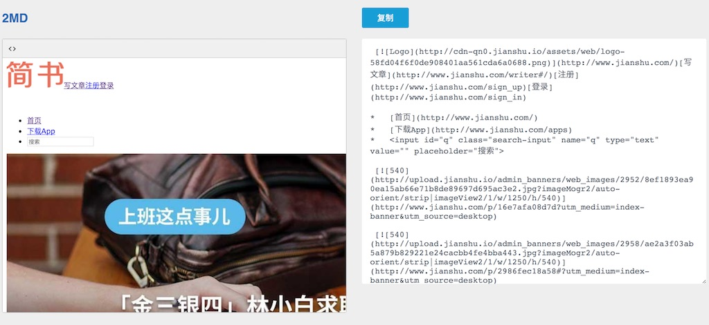

# 2md: A Converter for Copy/Paste content to Markdown

markdown to Wechat Public（微信公众号）: [MDPub](https://github.com/phodal/mdpub)

Features：直接复制、粘贴到编程器里。

Screenshots:

 

Base on：

 * TinyMce
 * to-markdown.js
 * clipboard

Inspired by [to-markdown](https://github.com/domchristie/to-markdown) - A Convert from html to markdown

LICENSE
---

© 2017 A [Phodal Huang](https://www.phodal.com)'s [Idea](http://github.com/phodal/ideas).  This code is distributed under the MIT license. See `LICENSE` in this directory.

[待我代码编成，娶你为妻可好](http://www.xuntayizhan.com/blog/ji-ke-ai-qing-zhi-er-shi-dai-wo-dai-ma-bian-cheng-qu-ni-wei-qi-ke-hao-wan/)
